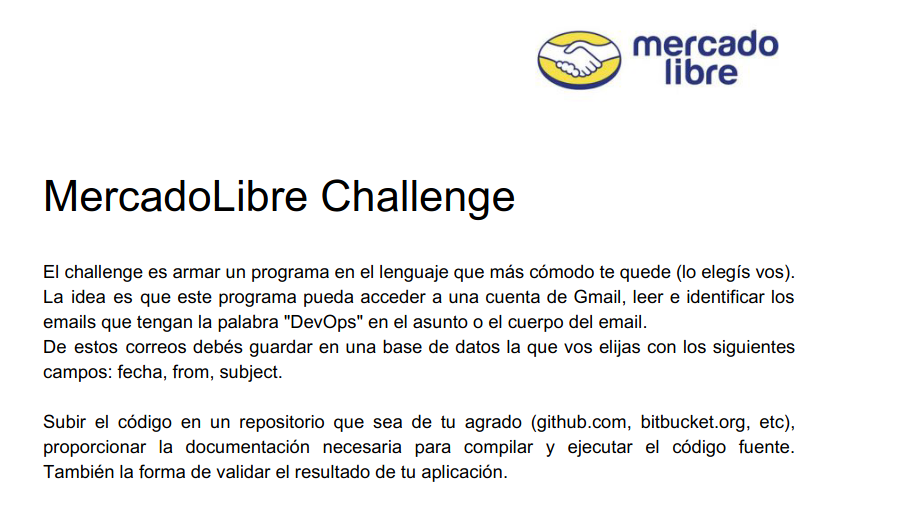

## Solución
Aplicación de arquitectura simple, orientado a capas,
del tipo interactivo a partir de la consola de comandos.

## Stack
- Golang
- Docker version 19.03.6, build 369ce74a3c
- Postgresql
- GNU Make 4.1

## Ejecución
1. Ejecutar la base de datos
```bash
make postgres-run
```
2. Generar la aplicación (Binario ejecutable)
```bash
make build
```
3. Ejecutar la aplicación
```bash
make run
```